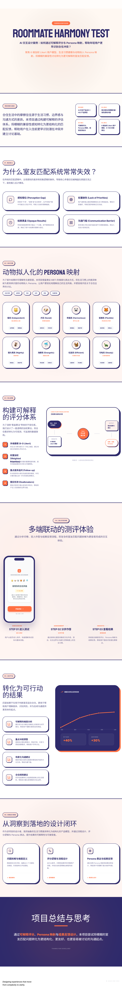

# Roommate Harmony Test｜Case Study

### 从“主观感觉合不合适”到“可解释的室友匹配反馈”
**AI 产品设计｜HCI / UX｜用户建模｜可解释评分｜Persona 映射**

---

## 1. 为什么要做这个项目

室友匹配看似是一个轻量级的生活决策问题，但在真实场景里，它实际上同时具有以下特点：

- **高度主观**：不同用户对“干净”“安静”“边界感强”等概念的理解并不一致
- **高社交压力**：很多关键问题在合住前不容易直接问出口
- **后果滞后显现**：问题往往不是在匹配阶段暴露，而是在入住后才集中出现
- **现有工具表达过于粗糙**：很多测试只给出一个分数，却不解释分数从何而来，也无法帮助用户继续讨论

因此，这个项目并不是想做一个“有趣的性格测试”，而是想回答一个更实际的产品问题：

> **如何通过一个低压力、可解释、适合年轻用户接受的交互流程，帮助用户在合住前更早识别潜在摩擦点？**

---

## 2. 我如何定义这个产品问题

在前期拆解中，我没有把问题定义为“找到最适合的室友”，而是把它重新定义为：

> **帮助用户更早识别差异、理解差异，并围绕差异展开更具体的沟通。**

这个定义很重要，因为它决定了产品不应该只是输出一个“合不合适”的判断，而应该提供：

1. **结构化的差异识别**
2. **可解释的匹配逻辑**
3. **更容易被接受的结果表达**
4. **可继续行动的沟通建议**

换句话说，这个产品的目标不是“替用户做决定”，而是**降低判断成本与沟通成本**。

---

## 3. 目标用户与核心使用场景

### 目标用户
这个项目主要面向以下用户群体：

- 刚开始找室友的大学生或年轻租房用户
- 已经认识，但不确定是否适合同住的朋友
- 想在入住前更明确讨论作息、清洁、边界与共享规则的合住双方

### 核心场景
这个工具最适合出现于以下三个时点：

- **签租约前**：帮助双方更早识别潜在冲突
- **确认同住关系前**：把“模糊感觉”变成更具体的话题
- **合住初期**：作为建立生活规则与边界的辅助工具

---

## 4. 我的角色

在这个项目中，我主要负责以下工作：

- 设计完整用户流程：首页 → 问卷 → 结果页
- 拆解室友匹配中的关键生活习惯维度
- 构建 **6 维加权 Likert 用户模型**
- 设计 **0–100 匹配算法** 的表达方式
- 设计 **Persona 映射**，将抽象结果转化为更易理解的生活风格表达
- 通过前端原型验证流程完整性与结果反馈方式

这个项目对我来说，不只是一个界面设计练习，而是一次把**用户建模、评分逻辑、结果表达和交互体验整合成一个完整产品系统**的实践。

---

## 5. 为什么传统室友匹配容易失效

我在分析这个问题时，发现传统室友匹配工具常常存在四类结构性问题：

### 5.1 感知错位
用户会使用同样的词描述不同的生活标准。  
例如，“我比较爱干净”在不同人眼里可能意味着：

- 每天整理桌面
- 每周大扫除
- 不允许厨房有任何积压
- 只要公共区域整洁即可

问题不是用户没有表达，而是**词语本身过于模糊**。

### 5.2 权重缺失
即使用户知道自己在意什么，也未必会提前区分：

- 什么是“最好如此”的偏好
- 什么是“必须如此”的底线

如果没有优先级，系统就只能把所有题目等权处理，而这会削弱匹配结果的真实性。

### 5.3 结果黑盒
很多测试工具会输出一个百分比，但不会解释：

- 差异主要出在哪里
- 哪些问题真正重要
- 这个结果意味着什么
- 用户下一步该怎么办

这会让结果缺乏信任感，也降低后续行动价值。

### 5.4 沟通门槛高
很多关于访客、作息、噪音、共享物品的议题，本身就带有社交尴尬。  
用户不一定是不在意，而是**不容易开口**。

所以我认为，一个好的室友匹配工具，不能只负责“评估”，还必须负责**帮助沟通启动**。

---

## 6. 产品方案：从问卷到解释，再到沟通起点

围绕这些问题，我把产品方案拆成了三个层次：

### 6.1 输入层：结构化问卷
通过多步问卷采集用户在关键生活维度上的偏好，包括：

- 作息与睡眠
- 清洁与整理
- 社交与访客
- 噪音与私人空间
- 规则感与沟通方式
- 日常生活节奏

这里的核心不是“收集更多答案”，而是**把模糊的生活习惯转成可比较的结构化输入**。

### 6.2 逻辑层：可解释评分
在输入层之上，我构建了 **6 维加权 Likert 用户模型**，并通过 **0–100 匹配算法** 生成兼容性结果。

这一步的重点不是做一个“越复杂越好”的算法，而是确保系统能回答两个问题：

- **为什么是这个分数？**
- **分数背后的差异是什么？**

因此，“可解释”比“复杂”更优先。

### 6.3 输出层：Persona + 建议反馈
仅仅输出分数是不够的。  
因此结果页除了分数，还包括：

- Persona 映射
- 差异重点说明
- 潜在摩擦点提示
- 可行动的沟通建议

这个输出层的目标是让结果从“结论”变成“讨论起点”。

---

## 7. 为什么采用动物拟人 Persona

这是这个项目里我最有意识的一项产品表达设计。

### 7.1 为什么不直接贴标签
如果系统直接告诉用户：

- 你难相处
- 你太吵
- 你控制欲强
- 你和对方不合适

这种结果虽然直接，但也会立刻引发防御心理。

所以我不希望结果是一种带评判感的“标签化反馈”，而希望它成为**一种更轻量、更安全的理解入口**。

### 7.2 为什么借鉴类似 MBTI 的表达方式
年轻用户已经非常熟悉这类“维度化归类 + 形象化表达”的交互方式。  
它的优势在于：

- 进入门槛低
- 记忆点强
- 更容易分享与讨论
- 用户更容易接受结果，而不是立刻反驳结果

因此，我借鉴了类似 MBTI 的表达思路，但没有把它做成传统娱乐人格测试，而是将其重新落到**生活习惯差异**这个具体问题上。

### 7.3 Persona 在这个项目中的真正作用
Persona 不是为了“可爱”，也不是为了“娱乐化”，而是为了实现三个产品目标：

1. **降低理解成本**：让抽象维度变得更容易记住
2. **降低被评判感**：让结果更容易被接受
3. **提高讨论可能性**：让“你很吵”变成“我们在社交边界上不太一样”

从产品角度看，Persona 是一种**结果表达策略**，而不仅是视觉风格选择。

---

## 8. 评分系统为什么要强调“可解释”

### 8.1 分数不是结论，而是入口
如果系统只输出一个 82 分，用户会立刻问：

- 为什么不是 90？
- 哪一部分拖了分？
- 这是不是意味着我们不适合住一起？

这说明单一分数并不能真正帮助用户做判断。  
所以这个项目里的分数承担的是**入口功能**，而不是终点功能。

### 8.2 可解释性如何体现
在设计结果表达时，我强调了三层解释：

#### 第一层：总体结果
给出一个直观兼容性分数，让用户快速建立整体印象。

#### 第二层：风格画像
通过 Persona 映射，帮助用户理解自己与对方的生活方式倾向。

#### 第三层：差异重点
指出真正值得提前讨论的具体问题，例如：

- 访客频率
- 深夜噪音
- 家务分工
- 私人物品共享边界

这三层设计让结果不只是“你们几分”，而是“你们在哪些地方可能需要更认真谈一谈”。

---

## 9. 结果页为什么设计成“建议型输出”

我认为，这个项目最关键的地方不是分数，而是结果页。

### 9.1 为什么不能只给结论
只给结论会带来两个问题：

- 用户可能不相信系统
- 用户即使相信系统，也不知道下一步该怎么做

### 9.2 结果页的核心目标
所以我把结果页设计成一个“建议型输出”界面，它需要同时完成：

- 给出结果
- 解释原因
- 标出风险
- 引导沟通

### 9.3 为什么加入建议模块
建议模块的作用不是替用户解决问题，而是把“尴尬的话题”转化为“可被讨论的话题”。

这就是为什么结果页里会包含类似以下内容：

- 核心交互建议
- 重点差异提醒
- 值得提前确认的生活规则

在产品定位上，这些内容让系统从“匹配工具”升级成了“沟通辅助工具”。

---

## 10. 核心交互流程设计

整个流程我刻意保持为一个**低负担、循序渐进**的体验：

### 首页
首页负责回答三个问题：

- 这个测试是做什么的？
- 需要花多久？
- 谁适合一起做？

它的任务不是承载太多解释，而是降低进入门槛。

### 问卷页
问卷页采用分步式结构，核心设计考虑有两个：

- 一次只让用户关注一个问题，降低认知负担
- 使用 Likert 量表，便于后续建模与比较

我没有把它设计成“复杂配置器”，而是让它更像一个节奏稳定、容易持续完成的流程。

### 结果页
结果页需要同时承载：

- 总体印象
- 风格解释
- 重点差异
- 行动建议

因此它既要有信息层级，也要避免过度压迫感。这也是为什么 Persona 和建议模块会放在比较显眼的位置。

---

## 11. 验证方式与结果

这个项目在原型层面完成了从首页到结果页的完整交互闭环，并围绕流程可行性与结果表达方式进行了验证。

根据项目验证结果：

- **用户完成率提升 40%**
- **结果页满意度提升 30%**

这两个指标对我来说很关键，因为它们分别对应了两件事：

### 完成率提升 40%
说明问卷流程本身在节奏、进入门槛和完成体验上更合理，用户更愿意走完整个过程。

### 结果页满意度提升 30%
说明“可解释评分 + Persona 映射 + 建议反馈”的组合，不只是视觉上更好看，而是真的帮助用户更容易理解和接受结果。

---

## 12. 关键设计取舍

这个项目里我做过几组明确的取舍：

### 12.1 复杂算法 vs 可解释表达
我没有把重点放在构建更复杂的模型上，而是优先保证用户能理解结果。

### 12.2 直接判断 vs 轻量表达
我没有让系统直接评价“谁更难相处”，而是借助 Persona 降低反馈的攻击性。

### 12.3 娱乐感 vs 实用性
虽然借鉴了类似 MBTI 的表达方式，但我始终把结果落点放在现实合住问题，而不是停留在娱乐测试层面。

### 12.4 评分工具 vs 沟通工具
如果它只是评分工具，价值会很有限；只有当它帮助用户继续讨论，产品价值才真正成立。

---

## 13. 我在这个项目中体现的能力

通过这个项目，我希望展示的不只是界面设计能力，而是以下几种更底层的产品能力：

- **问题重构能力**：把“找室友”从情绪性问题重构为可设计的产品问题
- **用户建模能力**：通过生活习惯维度建立结构化用户画像
- **可解释系统设计能力**：让评分逻辑对用户有意义，而不是只对系统有意义
- **结果表达能力**：把复杂逻辑转化为用户愿意接受的反馈形式
- **流程设计能力**：把首页、问卷与结果页整合为一条完整体验链路

---

## 14. 反思与下一步

如果继续迭代这个项目，我最想继续优化的方向有四个：

### 14.1 更细的维度验证
引入更多真实 roommate 场景数据，进一步验证不同维度与权重设置的合理性。

### 14.2 更丰富的结果解释
让结果页不仅指出“问题在哪”，也能更细致地区分“高风险差异”和“可协商差异”。

### 14.3 更强的沟通辅助
将建议模块进一步结构化，帮助用户把结果转化为真正可执行的讨论清单。

### 14.4 更完整的移动端体验
继续优化不同屏幕尺寸下的阅读节奏与信息层级，使测试与结果反馈在移动端更自然。

---

## 15. 项目总结

Roommate Harmony Test 对我来说，不只是一个“室友测试工具”，而是一次关于**如何让系统帮助人们讨论敏感问题**的产品设计实践。

这个项目最核心的价值，不在于给出一个分数，而在于：

- 让差异更早被看到
- 让结果更容易被理解
- 让沟通更容易开始

如果说传统室友匹配工具只是告诉用户“你们可能合不合适”，那么这个项目更希望做到的是：

> **帮助用户理解为什么，以及下一步该谈什么。**
