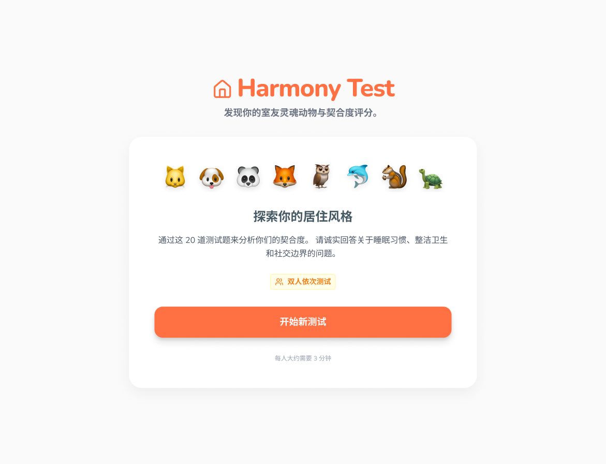
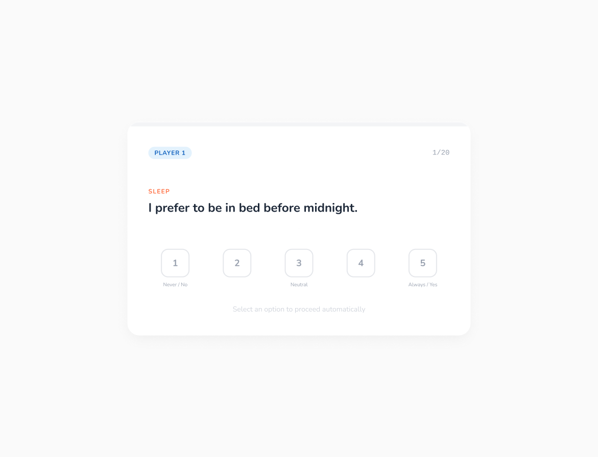
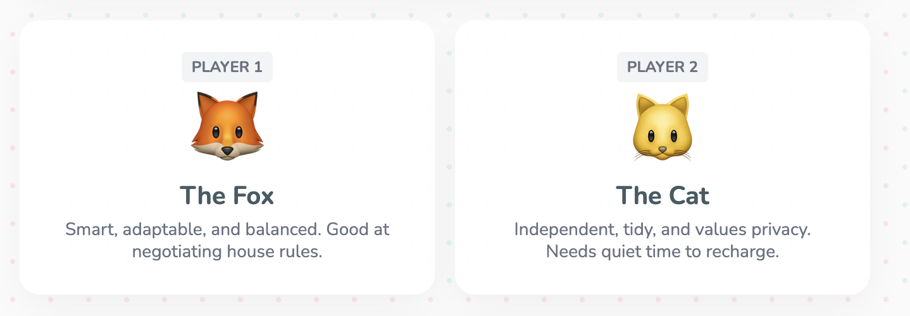
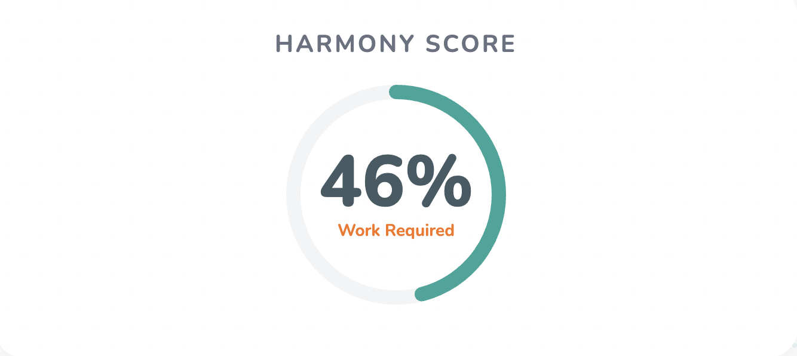
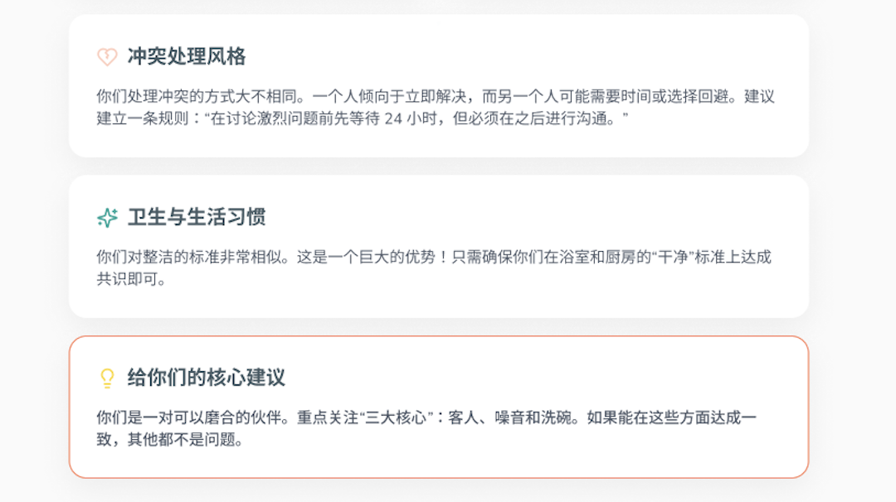

# Roommate Harmony Test｜AI 交互产品设计

**HCI / UX｜可解释评分系统｜Persona 映射｜前端交互原型**

## 项目简介
Roommate Harmony Test 是一个围绕“室友匹配”场景设计的 AI 交互产品原型，目标是帮助用户在合住前更早识别潜在生活摩擦点，并把原本难以启齿的现实问题，转化为更容易开始的结构化对话。

不同于传统基于兴趣或表面偏好的匹配方式，这个项目更关注真实共同生活中更容易引发冲突的因素，例如作息、清洁习惯、社交边界、噪音容忍度与沟通方式。

## 我的角色
我在这个项目中主要负责：

- 设计完整用户流程：首页 → 问卷 → 结果页
- 设计行为维度与评分逻辑
- 构建 6 维加权 Likert 用户模型
- 实现 0–100 匹配算法
- 通过 Persona 映射生成个性化解释
- 通过前端原型验证流程可行性

## 核心思路
这个项目希望解决的问题不是“你们兴趣像不像”，而是“你们能不能舒服地住在一起”。

为此，我将用户在作息、清洁、社交边界、沟通方式等维度上的回答转化为结构化行为画像，并通过可解释评分系统输出兼容性结果，而不是只给出一个黑箱式结论。

## 为什么采用动物拟人 Persona
为了让测试结果更容易被年轻用户接受，这个项目借鉴了类似 MBTI 的维度化表达思路，将用户在不同生活习惯维度上的倾向映射为不同的动物拟人 Persona。

相比直接给出冷冰冰的匹配分数，这种方式更轻松、更有记忆点，也更符合年轻用户熟悉的人格测试式交互体验。它不仅提升了结果的可理解性，也让“室友是否合适”这个原本略显敏感的话题，变得更容易讨论。

## 关键亮点
- **生活习惯优先**：关注真实合住场景中的摩擦点，而不是表面兴趣
- **可解释评分**：通过 6 维加权模型与 0–100 匹配算法生成透明结果
- **Persona 映射**：用更轻量、更友好的方式呈现生活风格差异
- **结果可行动**：不仅告诉用户“合不合适”，也提示值得提前沟通的问题

## 用户流程
首页 → 开始测试 → 多步问卷 → 评分计算 → Persona 映射 → 结果页反馈

## 页面展示

### 问卷流程

### Persona 展示

### 可解释评分系统

### 结果页

## 技术与方法
- **产品设计**：用户流程设计、信息架构、结果页策略
- **交互设计**：多步问卷、移动端流程、可解释反馈
- **建模逻辑**：6 维加权 Likert 用户模型
- **评分系统**：0–100 兼容性匹配算法
- **结果解释**：Persona 映射 + 行为差异说明
- **原型实现**：Web-based front-end prototype

## 项目成果
- 完成从首页到问卷再到结果页的完整交互流程设计
- 通过前端原型验证产品流程与结果表达方式
- 将主观室友匹配问题转化为结构化、可解释的产品系统
- 结合 Persona 表达提升结果接受度与年轻用户互动感

## 项目定位
这不是一个娱乐化性格测试，而是一个围绕 **人机交互、可解释评分与行为差异识别** 设计的 AI 交互产品原型。
